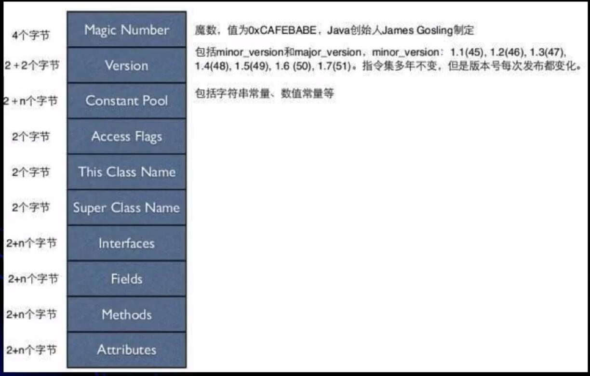
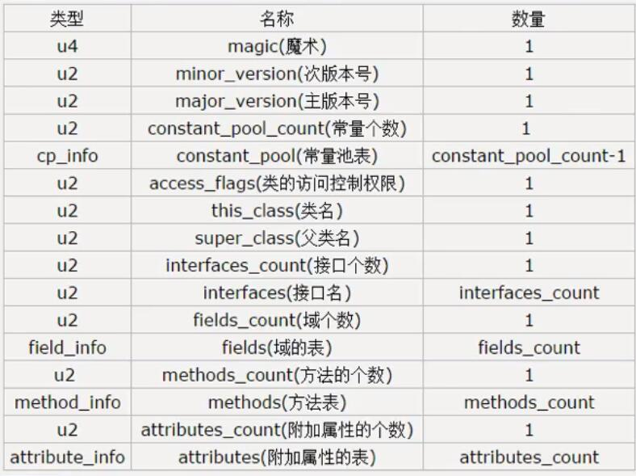
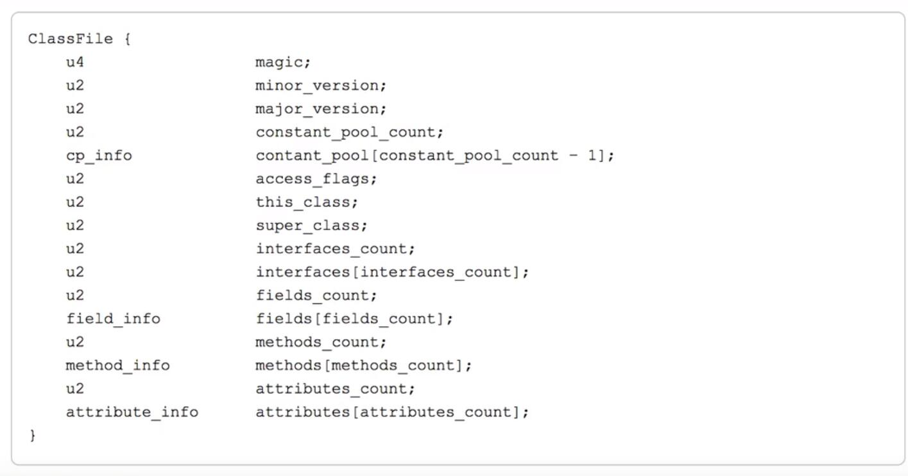
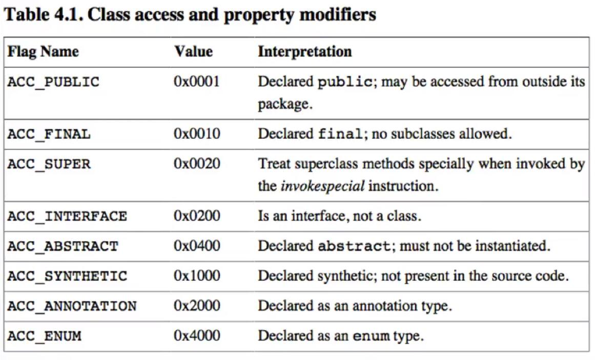
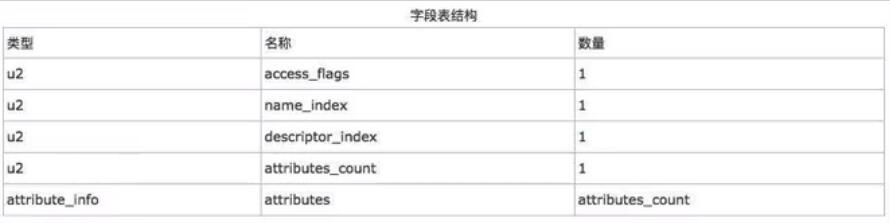
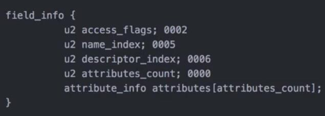
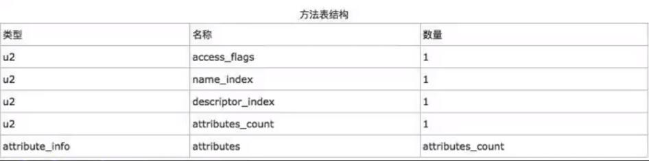
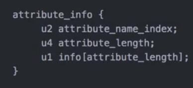
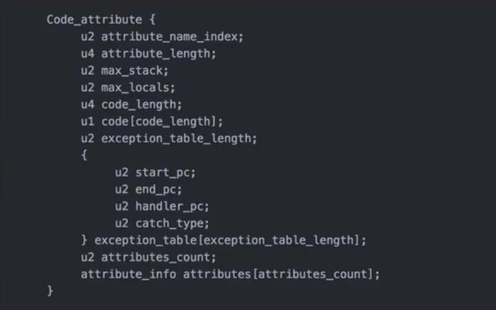
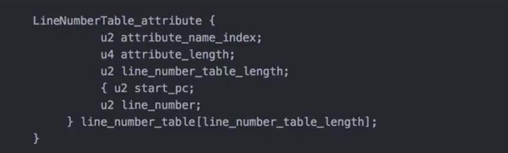

# 字节码

## `javap` 命令
**简单使用**
```
// 不需要加.class
javap MyTest1

// 查看更详细的信息
javap -c MyTest1

// 查看更详细的信息
javap -verbose MyTest1
```

**说明**
1. 使用 `javap -verbose` 命令分析一个字节码文件时，将会分析看该字节码文件的魔数、版本号、常量池、类信息、类的构造方法、类变量与成员变量等信息
    - 魔数、版本号、常量池、类信息、类的构造方法、类变量与成员变量

## 详细说明
**魔数**

所有的.class字节码文件的前4个字节都是魔数，魔数固定值: `0xCAFEBABE`

**版本号**
- 魔数之后的4个字节为版本信息
- 前两个字节表示minor version(次版本号)，后两个字节表示的是major version(主版本号)
    ```
    00 00 00 34
    minor version: 0 
    major version: 1.8
    // 所以class文件的版本为 1.8.0
    ```
    - 可以通过 `java -version` 验证

**常量池（constant pool）**

- 紧接着主版本之后的就是常量池入口
- 一个Java类中定义的很多信息都是由常量池来维护和描述的
    - 可以将常量池看作class文件的资源仓库，比如说Java类中定义的方法与变量信息
- 常量池主要存储两类常量
    - 字面量
        > 如文本字符串，Java中声明为final的常量值等
    - 符号引用
        > 如类和接口的全局限定名，字段的名称和描述符，方法的名称和描述符等。
- 常量池的总体结构：Java类所对应的常量池主要由常量池数量与常量池数组这两部分共同构成。
    - 常量池数量紧跟在主版本后面，占据2个字节
    - 常量池数组紧跟在常量池数量之后
    - 常量池数组与一般的数组不同的是
        - 常量池中不同的元素的类型、结构都是不同的，长度不同
        - **但是每一种元素的第一个数据都是一个 u1 类型**
            - 该字节是个标志位，占据一个字节
            - Jvm在解析常量池时，会根据这个 u1 类型来获取元素的具体类型
    - 值得注意的是：
        - `常量池数组中元素的个数 = 常量池数 - 1 (其中0暂时不使用)`
        - 为什么要 `-1` ？ : 目的是满足某些常量池索引值的数据在特定情况下需要表达 "不引用任何一个常量池" 的含义
            - 根本原因在于，索引为0也是一个常量(保留常量)，只不过它不位于常量表中，这个常量就对应null值，索引常量值的索引从1开始
- 常量池常量的长度怎么确定
    
    - 类似与对常量在常量池中编码
- 在JVM规范中，每个变量/字段都有描述信息，描述信息主要的作用是描述字段的数据类型、方法的参数列表（包括数量、类型与顺序）与返回值
    - 基本数据类型和代表无返回值的void类型都用一个大写字符来表示
    - 对象类型则使用 `字符L + 对象的全限定名称` 来表示
    - 为了压缩字节码文件的体积，对于基本数据类型，JVM都只使用一个大写字母来表示
        ```
        B - byte , C -char , D - double , F - float
        I - int , J - long , S - short , Z - boolean
        V - void 
        L - 对象类型 e.g. Ljava/lang/String;
        ```
    - 对于数组类型来说，每一个纬度使用一个前置的 `[` 来表示
        - `int[]` 记录为 `[i`
        - `String[][]` 记录为 `[[Ljava/lang/String;`
- 用描述符来描述方的时候，按照先参数列表，后返回值的顺序来描述。参数列表按照参数的严格顺序放在一组 `()` 之内
    - 例如: `String getRealnameByIdAndNickName(int id,String name)`
        - JVM字节码描述： `(I,Ljava/lang/String;)Ljava/lang/String;`

### Java字节码整体结构



- other img



- **表格示意**

|类型|名称|数量
|:---:|:---|:---:
|u4|magic(魔数)|1
|u2|minjor_version (次版本号)|1
|u2|major_version (主版本号)|1
|u2|constant_pool_count (常量个数)|1
|cp_info|constant_pool (常量池表)|constant_pool_count -1
|u2|access_flags (类访问控制权限)|1
|u2|this_class (类名)|1
|u2|super_class (父类名)|1
|u2|interfaces_count (接口个数)|1
|u2|interfaces (接口名称)|interfaces_count
|u2|fields_count (域个数)|1
|field_info|fields (域的表)|fields_count
|u2|methods_count (方法的个数)|1
|method_info|methods (方法表)|methods_count
|u2|attributes_count (附加属性的个数)|1
|attribute_info|attributes (附加属性表) |attributes_count

- 完整的Java字节码结构




- **Class字节码中有两种数据类型**
    - 字节数据直接量：
        > 这是基本的数据类型。共细分为 u1、u2、u4、u8 四种，分别代表连续的 1、2、4、8个字节组成的整体数据 
    - 表 （数组）:
        > 表是由多个基本数据或其他表，按照既定的顺序组成的大的数据集合。表是有结构的，它的结构体现在：组成表的成分所在的位置和顺序都是已经严格定义好的。
    - 上面的表中描述了11中数据类型的结构
        - 在jdk1.7之后又增加了3种
        - `CONSTANT_MethodHandle_info,CONSTANT_MethodType_info,CONSTANT_InvokeDynamic_info`

### 字节码访问标志与字段表详解 `Access_Flag`

访问标志信息包括该Class文件是类还是接口，是否被定义成public,是否是abstract,如果是类，是否被声明成final。

Access_Flag访问标志表


- `Ox 00 21`：是 `Ox 0020` 和 `Ox 0001` 的并集
    - 表示 `ACC_PUBLIC` 与 `ACC_SUPER`


### 字段表结构 `field_info`



- `Ox0002` 表示的是 `private`



- `attributes_count` 是可有可无的

### 方法表结构 `Method_info`




- index一般都会指向常量池中

- 方法的属性结构



- `Code` 一般就是方法的执行代码

- 方法的属性结构
    - JVM预定义了部分attribute，但是编译器自己也可以实现自己的attribute写入class文件里，供运行时使用。
    - 不同的attribute通过attribute_name_index来区分
    
    
### Code结构
`Code attribute` 的作用是保存该方法的结构，如所对应的字节码



- `attribute_length` 表示 `attribute` 所包含的字节数，不包含 `attribute_name_index` 和 `attribute_length` 字段
- `max_stack` 表示这个方法运行的任何时刻所能达到的操作数栈的最大深度
- `max_locals` 表示方法执行期间创建的局部变量的数目，包含用来表示传入的参数的局部变量 
- `code_length` 表示该方法所包含的字节码的字节数以及具体的指令码
- 具体字节码即是该方法被调用时，虚拟机所执行的字节码
- `exception_table`,这里存放的是处理异常的信息
- 每个 `exception_table` 表项由 `start_pc` 、`end_pc`、`handler_pc`、`catch_type`组成

### LineNumberTable 和 LocalVariableTable

**LineNumberTable**
- `LineNumberTable`: 这个属性用来表示code数组中的字节码和Java代码行数之间的关系。
    - 这个属性可以用来在调试的时候定位代码执行的行数

- LineNumberTable结构



**LocalVariableTable**
- 从字节码的信息可以看出，`this` 是作为一种隐式的参数传递过来的
- 对于java语言来说，一个对象的实例方法一般都是会隐式的传递一个 `this` 参数
    - 可以看字节码中方法的 `Code` 的 `LocalVariableTable`


### 复杂的字节码以及分析

**synchronized**

- 如果加在方法上,方法的访问标记符表示为 `ACC_SYNCHRONIZED_`
    - JVM在真正执行的时候还是会进行获取锁和释放锁
- 如果是用代码块来执行，关注两个助记符
    - `monitorenter`
    - `monitorexit`
- `synchronized` 是可重入的锁
    - 同一个owner再次获取锁的时候，锁的计数器会+1
    - 每次退出的时候，锁的计数器-1

### 字节码的异常

**Java字节码对于异常的处理方式：**

1. 统一采用异常表的方式对异常进行处理
2. 在jdk 1.4.2之前的版本中，并不是使用异常表的方式对异常进行处理的，而是采用特定的指令来处理的
3. 当异常处理存在finally语句块时，现代化的JVM采取的处理方式是奖finally语句块的字节码拼接到每一个catch块后面
    - 换句话说，程序中存在多少个catch块，就会在每一个catch块后面重复多少个finally语句块的字节码
    - **不是使用跳转而是使用重复**


## 字节码是如何执行的

### 栈帧 (stack frame)

- 栈帧是一种用于帮助虚拟机执行方法调用与方法执行的数据结构
- 栈帧是一种数据结构
    - 封装了方法的局部变量变量、动态链接信息、方法的返回地址以及操作数栈等信息
        - 动态链接: 符号引用、直接引用
        - Java在编译期间是拿不到内存地址的
        - 符号引用是存在于常量池中
            - 有些符号引用在类加载或第一次使用的时候转换成了直接引用 （静态解析）
            - 另外一些符号引用则是在每次运行期转换成直接引用，这种转换称之为动态链接
                - 动态链接体现为Java的多态
- 局部变量
    - slot存储局部变量
        - 可能两个slot维护一个局部变量 (long,double)
    - slot可复用
        ```
          public void test(){
      
              int a = 3;
              if(a<4){
                  int b = 4;
                  int c = 5;
              }
              // 这里可能存在slot复用
              int d = 7;
              int e = 8;
          }
        ```
    
**方法的调用以及方法的执行理解栈帧**

- `invokeinterface`: 调用接口方法，实际上是在运行期间决定的，决定了到底调用实现该接口的哪个对象的特定方法
- `invokestatic`: 调用静态方法
- `invokespecial`: 调用自己的私有方法，构造方法(<init>)以及父类的方法
- `invokevirtual`: 调用虚方法，运行期动态查找的过程
- `invokedynamic`: 动态调用方法


**静态解析的4中类型**
1. 静态方法
2. 父类方法
3. 构造方法
4. 私有方法 （无法被重写）
    - 非私有方法是可以被重写的

- 以上4类方法称之为非虚方法，他们是在类加载阶段就可以将符号引用转换成直接引用

**方法的静态分派**
- 编译期

**方法的动态分派**
- 运行期

### 理解Java基于栈的解释执行
- 编译执行
    - `jit` 编译成机器码 （热点代码）
- 解释执行

### 通过字节码理解动态代理

## 工具

**jclasslib**