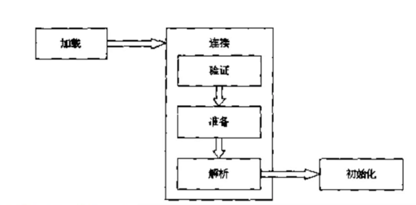
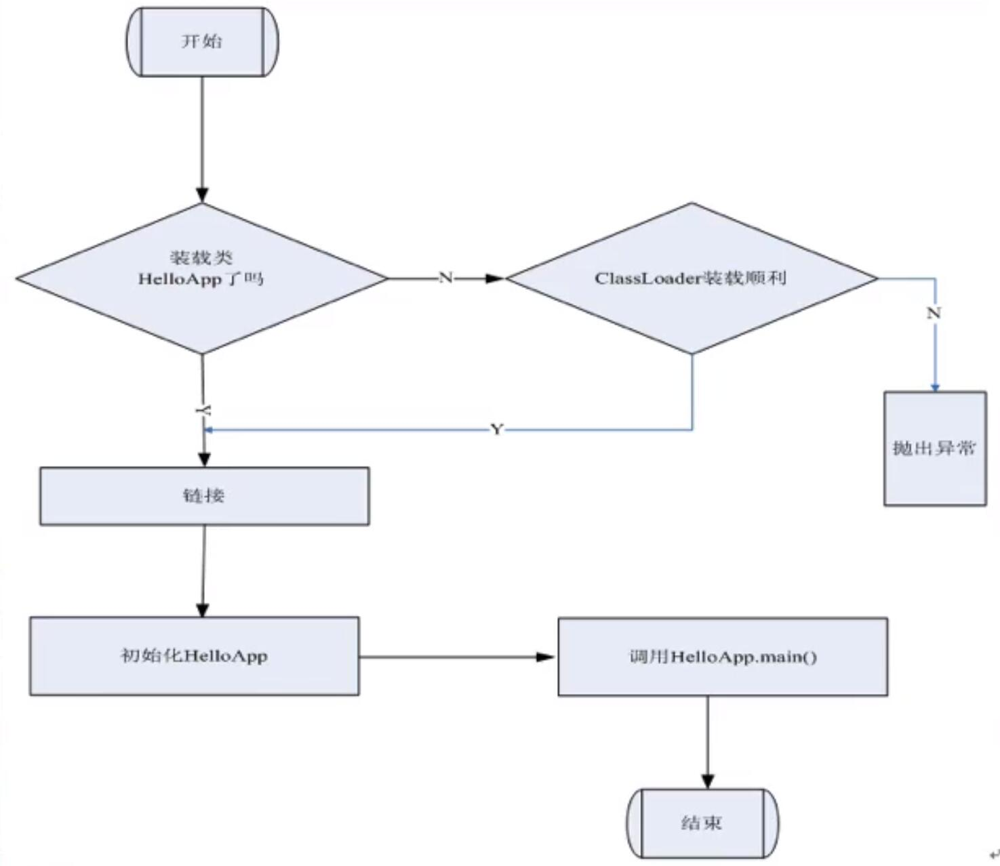

# 类加载

- 在Java代码中，**类型**的**加载**、**连接**与**初始化**过程都是在程序的**运行期间（`Runtime`）**完成的
    - 类型
    - 加载、连接、初始化
        - 加载：最常见的就是从磁盘上把编译好的字节码文件加载到内存里面
            - 并不一定严格按照顺序，比如说加载的时候对类与类的连接进行处理，这个要关注一下jvm规范
        - 连接：简单的说就是处理好类与类之间的关系
        - 初始化
            - 对类型里面的静态变量进行赋值
- 提供了更大的灵活性，增加了更多的可能性

## 类加载深入剖析

<font color=red>类加载器：用于加载类的工具</font>

Java虚拟机与程序的生命周期 以下情况下，Java虚拟机将结束生命周期

- 执行 `System.exit()`
- 程序正常执行结束
- 程序在执行过程中遇到了异常或错误而异常终止
    - 自我理解：Exception
- 由于操作系统出现错误而导致Java虚拟机进程终止
    - 自我理解：error

## 类的加载、连接、初始化



### 加载

查找并加载类的二进制数据

### 连接

<font color=blue>验证：</font>确保被加载的类的正确性

<font color=blue>准备：</font>为类的**静态变量**分配内存，并将其初**始化为默认值**

- 引用类型赋值为null
- 示例1
    ```java
    class Test{
        // 准备阶段 会赋予一个默认值0
        public static int a;
    }
    ```
- 示例2
    ```java
    class Test{
        // 在准备阶段并不是直接把a赋值为1，会赋予一个默认值0
        //  而是在后面的 【初始化】 阶段才把a赋值为1
        public static int a = 1;
    }
    ```

<font color=blue>解析：</font>把类中的符号应用转换为直接引用

- 符号引用，可以理解为
- 直接引用，指针直接指向内存地址

### 初始化

为类的<font color=red>静态变量</font>赋予正确的初始值

## 类的使用与卸载

- 使用
- 卸载

### Java程序对类的使用

<font color=red>注意: </font>是 Java 程序对类的使用，而不是对 对象的使用

所有的Java虚拟机实现必须在每个类或接口被Java程序**首次主动使用**时才初始化它们

- 关键点：<font color=red>**首次**，**主动使用**</font>
- 可以理解成，类已经在内存中加载和准备了，但是没有首次主动使用，并不会初始化类

### 主动使用 （应用层面） 会导致类的初始化

> 还有一个就是字节码层面

创建类的实例

```text
new XXX()
```

访问某个类或接口的静态变量，或者对该静态变量赋值

```text
字节码层面：访问： `getstatic`
字节码层面：赋值： `putstatic`
```

调用类的静态方法
```text
字节码层面 `invokestatic`
```

反射
```text
例如 `Class.forname(...)`
```

初始化一个子类

Java虚拟机启动时被标明为启动类的类

JDK1.7开始提供的动态语言支持

### 被动使用 不会导致类的初始化

除了对类的主动使用会导致类的初始化，其他的都不会导致对类的初始化
 
并不意味着类不会被加载

<font color=blue>加载和初始化是两种不同的概念</font>

## 类的加载

类的加载指的是将类的`.class`文件中的二进制数据读入到内存中，将其放在运行时数据区的方法区内，然后在内存中创建一个java.lang.Class对象（规范并没有说明Class对象位于哪里，HotSpot虚拟机将其放在了方法区中）用来封装类在方法区内的数据结构

### 加载.class文件的方式
- 从本地系统中直接加载
- 通过网络下载.class文件
- 从zip,jar等归档文件中加载.class文件
- 从专有数据库提取.class文件
- **将Java源文件动态编译为.class文件**
    - 动态代理，运行期才会存在的类，编译期不存在


## 类的主动使用示例

### 示例1

分析下面这段代码 `System.out.println(MyChild1.str);` [MyTest1.java](../jvm_lecture/src/main/java/org/iproute/jvm/classloader/MyTest1.java)
  ```java
  public class MyTest1 {
      public static void main(String[] args) {
          System.out.println(MyChild1.str);
      }
  }
  class MyParent1 {
      public static String str = "hello world";
      static {
          System.out.println("MyParent1 static block");
      }
  }
  class MyChild1 extends MyParent1 {
      public static String str2 = "welcome";
      static {
          System.out.println("MyChild1 static block");
      }
  }
  ```

输出结果
```text
MyParent1 static block
hello world
```

<font color=blue>分析：</font>
- **对于静态字段来说，只有直接定义了该字段的类才会被初始化**
    - 这段代码可以理解为对 `MyParent1` 的主动使用
    - 并**没有主动使用** `MyChild1`
- 所以 `str` 字段由 `MyParent1` 定义，只会导致 `MyParent1` 被初始化


### 示例2

分析下面这段代码 `System.out.println(MyChild1.str2);` [MyTest1.java](../jvm_lecture/src/main/java/org/iproute/jvm/classloader/MyTest1.java)

```java
public class MyTest1 {
    public static void main(String[] args) {
        System.out.println(MyChild1.str2);
    }
}

class MyParent1 {
    public static String str = "hello world";

    static {
        System.out.println("MyParent1 static block");
    }
}

class MyChild1 extends MyParent1 {
    public static String str2 = "welcome";

    static {
        System.out.println("MyChild1 static block");
    }
}
```

输出结果

```text
MyParent1 static block
MyChild1 static block
welcome
```

<font color=blue>分析：</font>
- 是对 `MyChild1` 的主动使用
- 但是在 **子类初始化之前必须先初始化父类**

### 示例3 编译期间可以确定的常量

分析下面的代码 主要分析**`final`**的对输出的影响 [MyTest2.java](../jvm_lecture/src/main/java/org/iproute/jvm/classloader/MyTest2.java)

```java
public class MyTest2 {
    public static void main(String[] args) {
        System.out.println(MyParent2.str);
    }
}

class MyParent2 {
    public static /*final*/ String str = "hello world";

    static {
        System.out.println("MyParent2 static block");
    }
}
```

**不加`final`**的输出结果

```text
MyParent2 static block
hello world
```

**加了`final`**的输出结果

```text
hello world
```

<font color=blue>分析：</font>
在编译阶段，`str`这个常量就会存入到调用这个常量的方法所在的类的常量池中

本质上，调用类并没有直接引用到定义常量的类，因此并不会触发定义常量的类的初始化
  - 这个例子中`MyTest2`去调用了这个**常量**
  - 所以在编译阶段，这个常量就会放到`MyTest2`的常量池中
  - 之后`MyTest2`和`MyParent2`就没有任何关系了
  - 甚至可以将`MyParent2`的`.class文件`**删除**都不会影响
  
尝试反编译，看下字节码里面的常量池
  - **`javap -c MyTest2.class`**

### 示例4 编译期间常量不可以确定值

分析下面代码 [MyTest3.java](../jvm_lecture/src/main/java/org/iproute/jvm/classloader/MyTest3.java)

```java
public class MyTest3 {
    public static void main(String[] args) {
        System.out.println(MyParent3.str);
    }
}

class MyParent3 {
    public static final String str = UUID.randomUUID().toString();

    static {
        System.out.println("MyParent3 static code");
    }
}
```

输出结果

```text
MyParent3 static code
acb824e0-4bea-4989-a3c2-010303bfc257
```

<font color=blue>分析：</font>
- <font color=red>只有运行期才会确定的常量值会导致目标类的初始化</font>

### 示例5 数组的创建并不会导致类的初始化

[代码示例 MyTest4.java](../jvm_lecture/src/main/java/org/iproute/jvm/classloader/MyTest4.java)

## 类加载-连接-初始化 再理解1



## 类加载、连接、初始化 再理解2


<font color=blue>加载：</font>就是把二进制形式的Java类型读入java虚拟机中

<font color=blue>连接</font>
  - **验证**
  - **准备**：为类变量分配内存，设置默认值。但是在到达初始化之前，类变量都没有初始化为真正的初始值
  - **解析**：解析过程就是在类型的常量池中寻找类、接口、字段和方法的符号引用，把这些符号引用替换成直接引用

<font color=blue>初始化：</font>为<font color=red>类变量</font>赋予正确的初始值

<font color=blue>类实例化：</font>
  - 为新的对象分配内存
  - 为实例变量赋予默认值
  - 为实例变量赋予正确的初始值
  - java编译器为它编译的每一个类都知道生成一个实例初始化方法，在java的class文件中，这个实例初始化方法称为 "`<init>`"。
      - 针对源码中的每一个二类的构造方法，java编译器都会产生一个 "`<init>`" 方法

## 类的加载

类的加载的最终产品是为与内存中的Class对象

`Class对象` 封装了类在方法区内的数据结构，并且向Java程序员提供了访问 `方法区` 的数据结构的接口

有两种类型的类加载器
- Java虚拟机自带的加载器
    - 启动类加载器（BootStrap）
    - 扩展类加载器 (Extension)
    - 系统（应用）类加载器 (Application)
- 用户自定义的类加载器
    - java.lang.ClassLoader的子类
    - 用户自己定制的加载方式

JVM规范允许类加载器在预料到某个类将要被使用时就预先加载它，如果在预先加载的过程中遇到了`.class`文件缺失或存在错误，类加载器必须在程序**首次主动使用**该类的时候才报告错误（LinkageError）
    - <font color=blue>如果这个类一直没有被程序主动使用，那么类加载器就不会报告错误</font>

### 类的验证

类文件结构检查
  - 字节码里面的内容

语义检查

字节码验证

二进制兼容性验证

###  类的准备
在准备阶段，Java虚拟机会为类的静态变量分配内存，并设置默认的初始值

例如下面的Sample类，在准备阶段，将为int类型的静态变量a分配4个字节内存空间，并赋予默认值0，为long类型的静态变量b分配8个字节的内存空间，并赋予默认值0

```java
class Sample {
    private static int a = 1;
    private static long b;

    static {
        b = 2L;
    }
}
```

### 类的初始化

在初始化阶段，Java虚拟机执行类的初始化语句，为<font color=red>类的静态变量</font>赋予初始值

在程序中，静态变量的初始化有两种途径
    - 在静态变量的声明处进行初始化
    - 在静态代码块中进行初始化

**类的初始化步骤**

- 假如这个类还没有类加载和连接，那就先进行加载和连接
- 假如类存在直接父类，并且这个父类还没有被初始化，那就先初始化父类
- 假如类中存在初始化语句，那就一次执行这些初始化语句

**类的初始化时机**
> 主动使用

- 创建类的实例
- 访问某个类或接口的静态变量，或者对该静态变量赋值
- 调用类的静态方法
- 反射
- 初始化一个类的子类
- 被标记为启动类
- 动态代理等。。。

**类的初始化时机理解2**

- 类加载器用来把类加载到Java虚拟机中。从JDK1.2版本开始，类的加载过程采用**双亲委托机制**，这种机制能更好低保证Java平台的安全，在此委托机制中，除了Java虚拟机自带的根类加载器外，其余的类加载器有且只有一个父类加载器。

- 根类加载器

> 该加载器没有父加载器。它负责加载虚拟机的核心类库，如 `java.lang.*` 等，`java.lang.Object`就是由根类加载器加载的
> <bri> 根类加载器从系统属性 `sun.boot.class.path` 所指定的目录中加载类库。根类加载器的实现依赖于底层操作系统，属于虚拟机实现的一部分

- 扩展类加载器

> 它的父类加载器为根类加载器。它从 `java.exe.dirs` 系统属性所指定的目录中加载类库，或者从JDK的安装目录的 jre/lib/ext 字目录（扩展目录）下加载类库，如果把用户创建的jar文件放在这个目录下，也会自动由扩展类加载器加载。
> <br>扩展类加载器是纯Java类，是 `java.lang.ClassLoader` 类的子类

- 系统类加载器（也称之为 应用类加载器）

> 它的父加载器为扩展类加载器。它从环境变量 `classpath` 或者系统属性 `java.class.path ` 所指定的目录加载类，它是用户自定义的类加载器的默认父加载器。
> <br>系统类加载器是纯Java类，是 `java.lang.ClassLoader` 类的子类

- 所用用户自定义的类加载器都应继承 `java.lang.ClassLoader`

**初始化对于类和接口的异同点**

- 当初始化一个类的时候，**并不会初始化它所实现的接口**
- 当初始化一个接口的时候，**并不会先初始化它的父接口**
- 因此，一个父接口的并不会因为它的子接口的初始化而初始化。只有当程序首次使用特定接口的静态变量时，才会导致接口的初始化
分析下面的例子

```java
public class Test{
  public static void main(String[] args){
    System.out.println(Child.b);
  }
}
interface Parent{
  int a = 5;
}
class Child extends Parent{
  public static int b = 5;
}
```

<font color=blue>结果</font>
- 这个接口会被加载，因为b不是一个常量，所以满足了对类的主动调用
    - 是加载不是初始化
- 类的加载会导致父类也被加载
    - 是加载不是初始化
- 如果加了final就不会导致初始化

> 试验的时候可以在编译完成的时候，<font color=red>将父接口的.class对象删除然后再次运行</font>，这个是和加载有关系的


