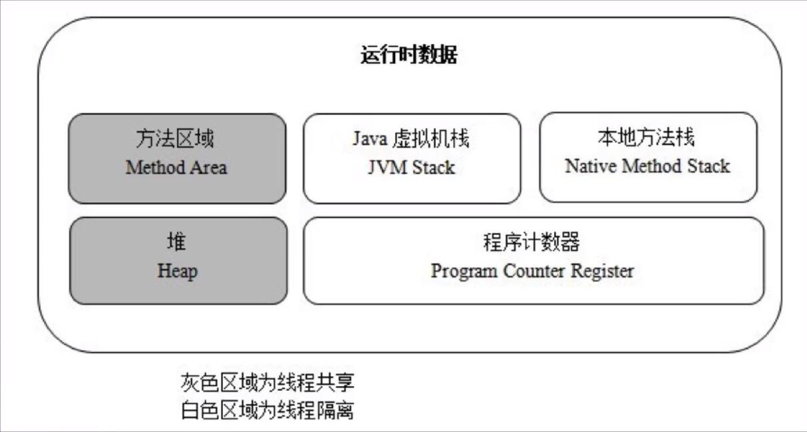
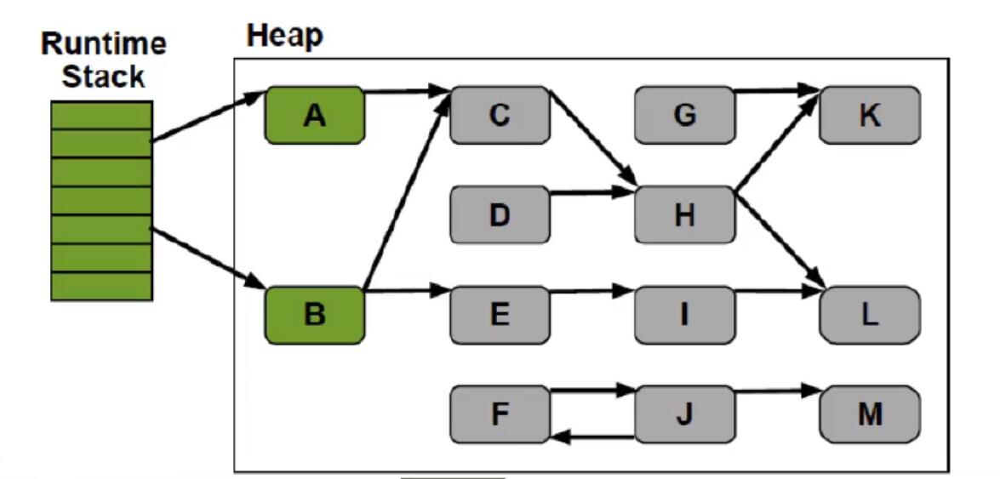
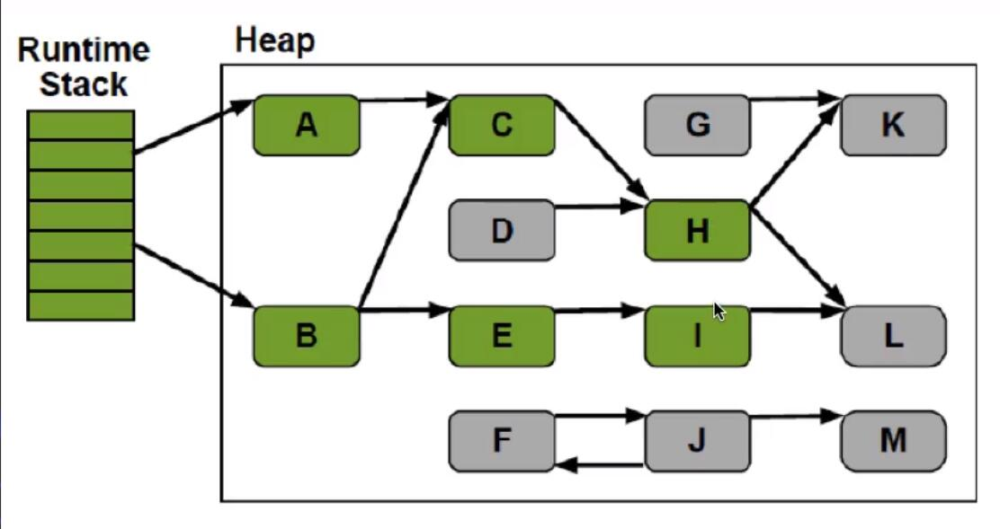
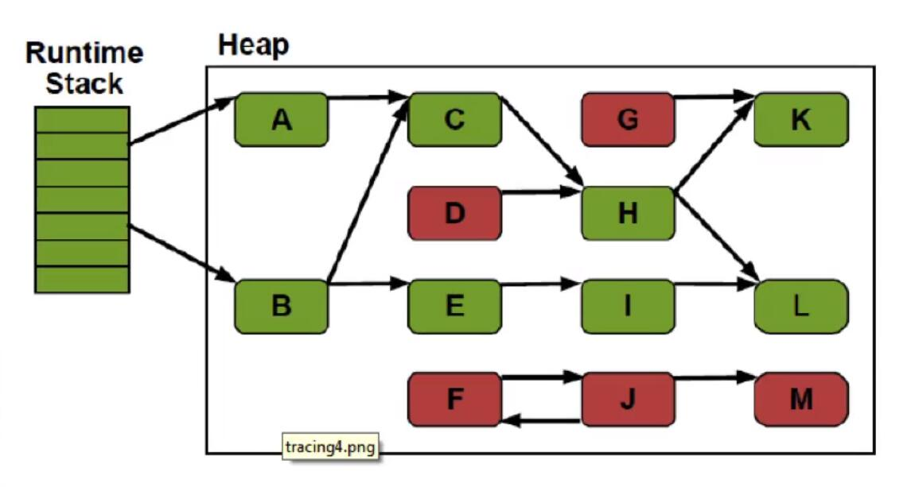
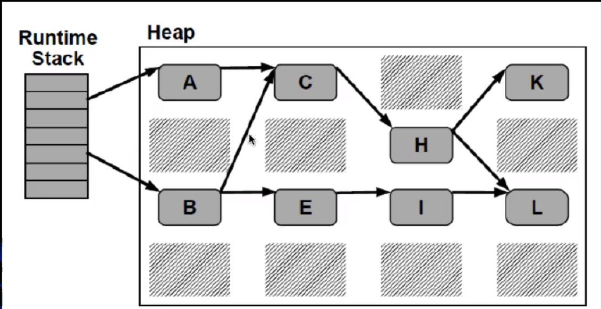

# JVM 垃圾回收

## JVM运行时内存数据区域

- 
    - 灰色区域为线程共享
    - 白色区域为线程隔离

### JVM运行时内存数据区域

- 程序计数器
- 本地方法栈
- Java虚拟机栈 (JVM Stack)
    - Java虚拟机栈描述的是Java方法的执行模型：
        - 每个方法执行的时候都会创建一个帧（Frame）
        - 栈用于存放局部变量表，操作栈，动态链接，方法出口等信息。
        - 一个方法的执行过程，就是这个方法对于栈帧的入栈出栈过程
    - 线程隔离
- 堆（Heap）
    - 堆里面存放的是对象的实例
    - 是Java虚拟机管理内存中最大的一块
    - GC主要的工作区域，**为了高效的GC，会把堆细分更多的子区域**
    - 线程共享
- 方法区域 (Method Area)
    - 存放了每个Class的结构信息，包括常量池、字段描述、方法描述
    - GC的非主要工作区域

### JVM运行时内存数据区域-例子

```
public void method1(){
    Object obj = new Object();
}
```

- 生成了2部分的内存区域
    - ① `obj` 这个引用变量，因为是方法内的变量，放到JVM Stack里面
    - ② 真正的Object Class 的实例对象，放到Heap里面
- 上述 new 语句用消耗了12个bytes，JVM规定应用占4个bytes(在JVM Stack里面)，而空对象是8个bytes(在heap)
- 方法结束后，**对应Stack中的变量马上回收，但是Heap中的对象要等到GC来回收**

## JVM垃圾回收（GC）

- 垃圾判断算法
- GC算法
- 垃圾回收期的实现和选择

### 垃圾判断算法

- 引用计数算法（Reference Counting）
- 根搜索算法（Root Tracing）

#### 引用计数算法
- 给对象添加一个引用计数器，当有一个地方引用它，计数器+1，当引用失效，计数器-1，任何时刻计数器为0的对象就是不可能再被使用的
- 引用计数算法**无法解决对象循环引用的问题**

#### 根搜索算法
- 在实际的生产语言中（Java C#等） ，都是使用根搜索算法判定对象是否存活
- 算法的基本思路就是通过一系列的称为 "`GC Roots`" 的点作为起始进行向下搜索
    - 当一个对象到 "`GC Roots`" 没有任何引用链(`Reference Chain`)向连，则证明此对象是不可用的 
- 在Java语言中，`GC Roots` 包括
    - 在VM栈（帧中的本地变量）中的引用
    - 方法区中的静态引用
    - JNI （即一般所说的native方法）中的引用
    
### 方法区的一些讲解
- Java虚拟机规范表示可以不要求虚拟机在这个区实现GC，这区GC的“性价比”一般比较低
- 在堆中，尤其是在新生代，常规应用进行一次GC一般可以回收70%~95%的空间
    - 而方法区的GC效率远小于此
- 当前的商业JVM都有实现方法区的GC，主要回收两部分内容：
    - 废弃常量与无用类
- 类回收需要满足如下3个条件
    - 该类的所有的实例都已经被GC，也就是JVM中不存在该Class的任何实例
    - 加载该类的ClassLoader已经被GC
    - 该类对应的java.lang.Class对象没有在任何地方被引用
        - 如不能再任何地方通过反射访问该类的方法
- 在大量使用反射、动态代理、CGLib等字节码框架、动态生成JSP以及OSGi这些频繁自定义ClassLoader的场景都需要JVM具备类卸载的支持以保证方法区不会溢出

### JVM常见GC算法
- 标记-清除算法 (`Mark-Sweep`)
- 标记-整理算法 (`Mark-Compact`)
- 复制算法 (`Copying`)
- 分代算法 (`Generational`)

#### 标记-清除算法
- 算法分为标记和清除两个阶段
    - 首先标记出所有需要回收的对象
    - 然后回收所有需要回收的对象
- 缺点
    - 效率问题，标记和清理两个过程效率都不高
    - 空间问题，标记清理后会产生大量不连续的内存碎片，空间碎片太多可能会导致后续使用中无法找到足够的连续内存而提前触发另一次的垃圾收集动作


- 左侧：运行时虚拟机栈，每一个都是一个栈帧
- 右侧是堆，箭头表示引用


- 标记为绿色的代表是有这个对象存在引用


- 标记为绿色的代表是有这个对象存在引用


- 标记为红色的就是没有被引用的


- 标记为阴影的就是被回收的对象

缺点分析
- 效率不高，需要扫描所有的对象。堆越大，GC越慢
- 存在内存碎片问题。GC次数越多，碎片化越严重


**个人理解**
- 有向图的可达性分析
- 个人思考的实现基于 `GC Root` 做一次遍历，然后遍历到的节点进行标记

#### 复制收集算法

