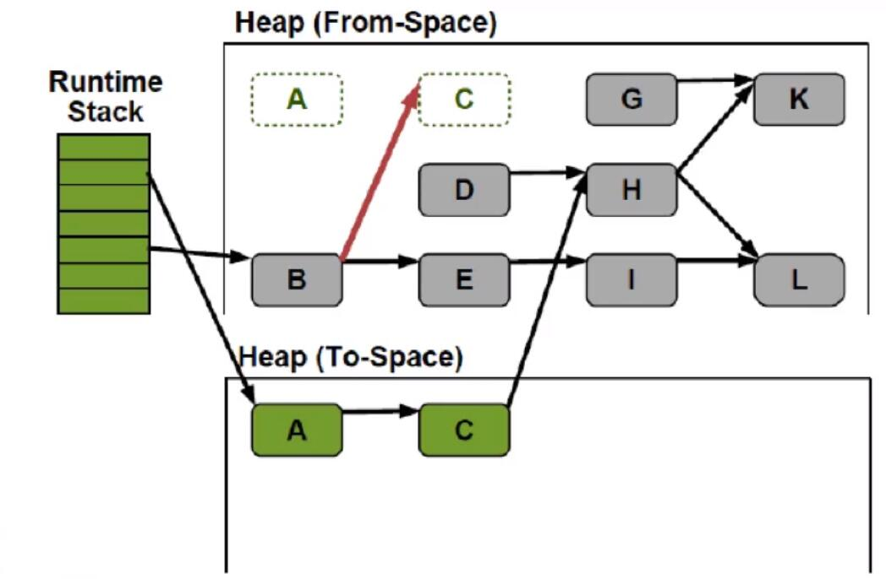
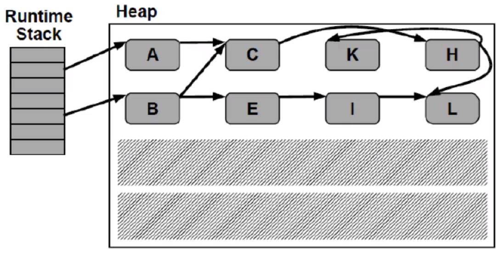
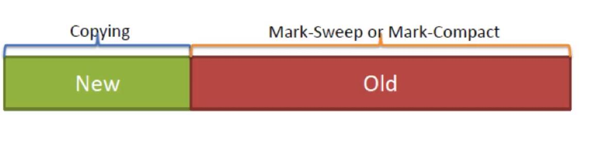
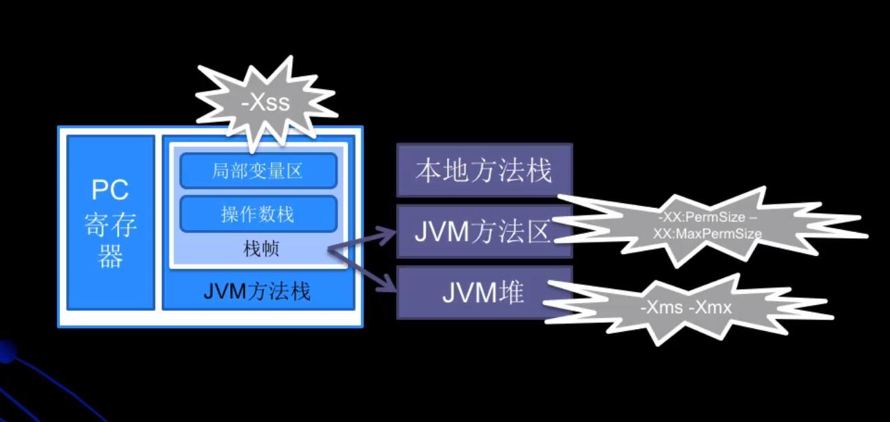
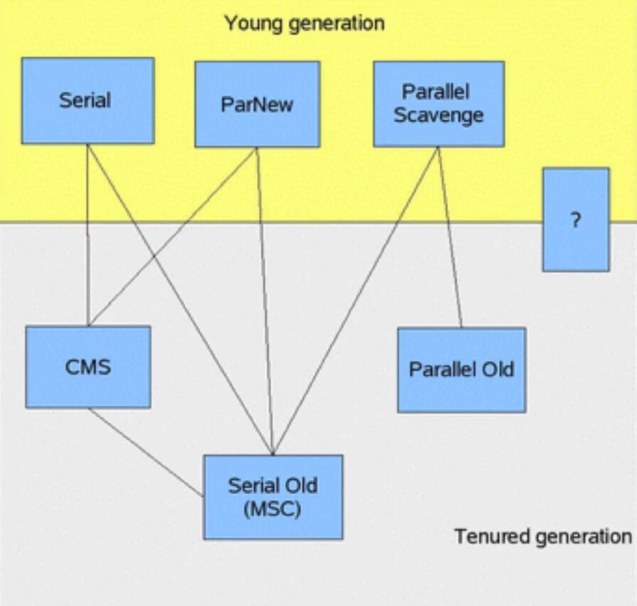
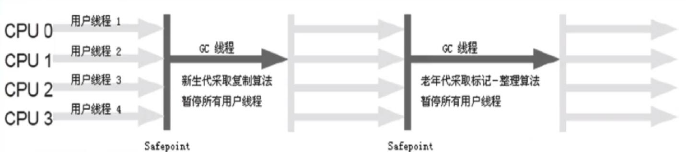
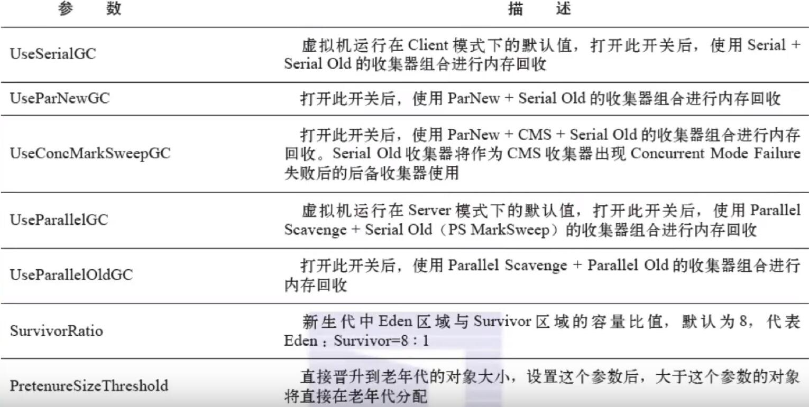

# JVM 垃圾回收

## JVM运行时内存数据区域

- 
    - 灰色区域为线程共享
    - 白色区域为线程隔离

### JVM运行时内存数据区域

- 程序计数器
- 本地方法栈
- Java虚拟机栈 (JVM Stack)
    - Java虚拟机栈描述的是Java方法的执行模型：
        - 每个方法执行的时候都会创建一个帧（Frame）
        - 栈用于存放局部变量表，操作栈，动态链接，方法出口等信息。
        - 一个方法的执行过程，就是这个方法对于栈帧的入栈出栈过程
    - 线程隔离
- 堆（Heap）
    - 堆里面存放的是对象的实例
    - 是Java虚拟机管理内存中最大的一块
    - GC主要的工作区域，**为了高效的GC，会把堆细分更多的子区域**
    - 线程共享
- 方法区域 (Method Area)
    - 存放了每个Class的结构信息，包括常量池、字段描述、方法描述
    - GC的非主要工作区域

### JVM运行时内存数据区域-例子

```
public void method1(){
    Object obj = new Object();
}
```

- 生成了2部分的内存区域
    - ① `obj` 这个引用变量，因为是方法内的变量，放到JVM Stack里面
    - ② 真正的Object Class 的实例对象，放到Heap里面
- 上述 new 语句用消耗了12个bytes，JVM规定应用占4个bytes(在JVM Stack里面)，而空对象是8个bytes(在heap)
- 方法结束后，**对应Stack中的变量马上回收，但是Heap中的对象要等到GC来回收**

## JVM垃圾回收（GC）

- 垃圾判断算法
- GC算法
- 垃圾回收期的实现和选择

### 垃圾判断算法

- 引用计数算法（Reference Counting）
- 根搜索算法（Root Tracing）

#### 引用计数算法
- 给对象添加一个引用计数器，当有一个地方引用它，计数器+1，当引用失效，计数器-1，任何时刻计数器为0的对象就是不可能再被使用的
- 引用计数算法**无法解决对象循环引用的问题**

#### 根搜索算法
- 在实际的生产语言中（Java C#等） ，都是使用根搜索算法判定对象是否存活
- 算法的基本思路就是通过一系列的称为 "`GC Roots`" 的点作为起始进行向下搜索
    - 当一个对象到 "`GC Roots`" 没有任何引用链(`Reference Chain`)向连，则证明此对象是不可用的 
- 在Java语言中，`GC Roots` 包括
    - 在VM栈（帧中的本地变量）中的引用
    - 方法区中的静态引用
    - JNI （即一般所说的native方法）中的引用
    
### 方法区的一些讲解
- Java虚拟机规范表示可以不要求虚拟机在这个区实现GC，这区GC的“性价比”一般比较低
- 在堆中，尤其是在新生代，常规应用进行一次GC一般可以回收70%~95%的空间
    - 而方法区的GC效率远小于此
- 当前的商业JVM都有实现方法区的GC，主要回收两部分内容：
    - 废弃常量与无用类
- 类回收需要满足如下3个条件
    - 该类的所有的实例都已经被GC，也就是JVM中不存在该Class的任何实例
    - 加载该类的ClassLoader已经被GC
    - 该类对应的java.lang.Class对象没有在任何地方被引用
        - 如不能再任何地方通过反射访问该类的方法
- 在大量使用反射、动态代理、CGLib等字节码框架、动态生成JSP以及OSGi这些频繁自定义ClassLoader的场景都需要JVM具备类卸载的支持以保证方法区不会溢出

### JVM常见GC算法
- 标记-清除算法 (`Mark-Sweep`)
- 标记-整理算法 (`Mark-Compact`)
- 复制算法 (`Copying`)
- 分代算法 (`Generational`)

#### 标记-清除算法
- 算法分为标记和清除两个阶段
    - 首先标记出所有需要回收的对象
    - 然后回收所有需要回收的对象
- 缺点
    - 效率问题，标记和清理两个过程效率都不高
    - 空间问题，标记清理后会产生大量不连续的内存碎片，空间碎片太多可能会导致后续使用中无法找到足够的连续内存而提前触发另一次的垃圾收集动作


- 左侧：运行时虚拟机栈，每一个都是一个栈帧
- 右侧是堆，箭头表示引用


- 标记为绿色的代表是有这个对象存在引用


- 标记为绿色的代表是有这个对象存在引用


- 标记为红色的就是没有被引用的


- 标记为阴影的就是被回收的对象

缺点分析
- 效率不高，需要扫描所有的对象。堆越大，GC越慢
- 存在内存碎片问题。GC次数越多，碎片化越严重


**个人理解**
- 有向图的可达性分析
- 个人思考的实现基于 `GC Root` 做一次遍历，然后遍历到的节点进行标记

#### 复制收集算法

- 将可用的内存空间划分为两块，每次只使用其中的一块，当半区内存用完了，仅将还存活的对象复制到另一块上面，然后就把原来整块内存空间一次性清理掉
- 这样使得每次内存回收都是对整个半区的回收，内存分配时也就不用考虑内存碎片等复杂情况，只要移动堆顶指针，按顺序分配内存就可以了，实现简单，运行搞笑。
    - 只是这种算法的代价是将内存缩小为原来的一半，代价高昂
- 现代商业虚拟机都是用了这一种收集算法来回收**新生代**
    - **新生代**：一般刚创建的对象都放在新生代里面
- 将内存非为一块较大的eden空间和2块较少的survivor空间，每次使用eden和其中一块survivor
    - 当回收时将eden和survivor还存货的对象一次性拷贝到另外一块survivor空间
    - 然后清理掉eden和用过的survivor
    - 两个survivor
        - from survivor
        - to survivor
- Oracle Hotspot 虚拟机默认eden和survivor的大小比例是8:1，也就是每次只有10%的内存是浪费的

- 复制收集算法在对象存活率高的时候，效率有所下降
- 如果不想浪费50%的空间，就需要又额外的空间进行分配担保用于应付半区内存中所有对象都100%存活的极端情况，所以在老奶奶带一般不能直接选用这种算法
---

- D和G是没有被引用的
---

---

---

---

- 清空所有的from空间
---

**特征**
- 只需要扫描存活的对象，效率更高
- 不会产生碎片
- 需要浪费额外的内存作为复制区
- 复制算法非常适合生命周期比较短的对象，因为每次GC总能回收大部分对象，复制的开销比较小
- 根据IBM专门研究，98%的Java对象只会存活1个GC周期，对这些对象很适合用复制算法。而且用1:1的划分工作区和复制区的空间

#### 标记整理算法 （`Mark-Compact`）

标记的过程任然一样，但后续步骤不是进行直接清理，而是令所有存活的对象一端移动，然后直接清理掉这端边界意外的内存。


- 整理结束的样子
---
- 没有内存碎片
- 比 Mark-Sweep 耗费更多的时间进行 compact


#### 分代收集算法
- 当前的商业虚拟机的垃圾收集都是采用“分代收集”（Generational Collecting）算法，根据对象不同的存活周期将内存划分为几块
- 一般是把Java对分作**新生代**和**老年代**，这样就可以根据各个年代的特点采用最适当的收集算法
    - 譬如新生代每次GC都有大批对象死去，只有少量存活，那就选用复制算法，只需要付出少量存活对象的复制成本就可以完成收集
- 综合前面几种GC算法的优缺点，针对不同生命周期的对象采用不同的GC算法


---

- 年轻代 （Young Generation）
    - 新生成的对象都放在新生代。年轻代用复制算法进行GC（理论上，年轻代对象的生命周期非常短，所以适合复制算法）
    - 年轻代分三个区。一个Eden区，两个Survivor区（可以通过参数设置Survivor个数）。对象在Eden区中生成。当Eden区满时，还存活的对象将被复制到另外一个Survivor区，当第二个Survivor区也满了的时候，从第一个Survivor区复制过来的并且此时还存活的对象，将被复制到老年代
        - 2个Survivor是完全对称，轮流替换
    - Eden和2个Survivor的缺省比例是8:1:1,也就是10%的空间会被浪费。可以根据GC log的信息调整大小的比例

- 年轻代 （Old Generation）
    - 存放了经过一次或多次GC还存活的对象
    - 一般采用 `Mark_Sweep` 或者 `Mark-Compact` 算法进行GC
    - 有多种垃圾收集器可以选择。每种垃圾收集器可以看作一个GC算法的具体实现。
        - 可以根据具体应用的需求选用合适的垃圾收集器
            - 追求吞吐量？
            - 追求最短响应时间？
            
- 永久代
    - 1.8之后废弃了

- Hotspot JVM 6的分代
    

---
### 内存结构


- 在HotSpot中，本地方法栈和JVM方法栈是同一个，因此也可以用`-Xss`控制

### 内存分配
1. 堆上分配
    - 大多是情况在eden上分配，偶尔会直接在old上分配
    - 细节取决于GC的实现
2. 栈上分配
    - 原子类型的局部变量

### 内存回收
GC要做的是将哪些dead的对象所占用的内存回收掉

- Hotspot认为没有引用的对象是dead的
- Hotspot将引用分为4种：`Strong`,`soft`,`Weak`,`Phantom`
    - `Strong` 即默认通过 `Object o = new Object`这种方式赋值的引用
    - `soft`,`Weak`,`Phantom` 这三种则都是继承 Reference

- 在Full GC时会对Reference类型的引用进行特殊处理
    - `Soft`: 内存不够时一定会被GC，长期不用也会被GC
    - `Weak`: 一定会被GC，当被mark为dead，会在ReferenceQueue中通知
    - `Phantom`: 本来就没引用，当从jvm heap中释放时会通知
    
### 垃圾收集算法

---

### GC的时机
- 在分代模型的基础上，GC从时机上分为两种：
    - Scavenge GC 和 Full GC
    - `ˈskavənjər`
- Scavenge GC (Minor GC)
    - 触发时机：新对象生成，Eden空间满了
    - 理论上Eden区大多数对象会在Scavenge GC回收，复制算法的执行效率会很高，Scavenge GC时间比较短
- Full GC
    - 对整个JVM进行整理，包括Young,Old和Perm
    - 主要出发时机：
        - ① Old满了
        - ② Perm满了
        - ③ `System.gc()`
    - 效率很低，尽量减少Full GC.
    - 一旦出现Full GC，业务线程会暂停一段时间

### 垃圾收集器

分代模型：GC的宏观愿景

垃圾回收器： GC的具体实现

HotSpot JVM提供多种垃圾回收器，我们需要根据具体应用的需要采用不同的垃圾回收器

没有万能的垃圾回收器，每种垃圾回收器都有自己使用的场景

垃圾收集器的**并行**和**并发**
- 并行（Parallel）：指多个收集器的线程同时工作，但是**用户线程处于等待状态**
- 并发（Concurrent）：指收集器在工作的同时，可以允许用户线程工作。
    - 并发不代表解决了GC停顿的问题
        - 在关键的步骤还是要停顿。比如在收集器标记垃圾的时候。
        - 在清楚垃圾的时候，用户线程可以和GC线程并发执行
        - 是一个动态的过程
        
#### Serial收集器
单线程收集器，收集时会暂停所有工作线程（`Stop The World` 简称`STW`），使用复制收集算法，虚拟机运行在Client模式时的默认新生代收集器

- 最早的收集器，单线程进行GC
- New和Old Generation都可以使用
- 在新生代，采用复制算法；在老年代，采用 `Mark-Compact` 算法
- 因为是单线程GC，没有多线程切换的额外开销，简单使用
- Hotspot Client模式缺省的收集器


- 期间会暂停用户线程
- `Safepoint` 安全点

---
#### ParNew 收集器
- ParNew收集器就是Serial的多线程版本，除了使用多个收集线程外，其余行为包括算法、STW、对象分配规则、回收策略等都与Serial收集器一模一样
- 对应的这种收集器是虚拟机运行在Server模式中的默认新生代收集器
    - 在单CPU的环境中，ParNew收集器并不会比Serial收集器有更好的效果
- Serial收集器在新生代的多线程版本
- 使用复制算法（因为针对新生代）
- 只有在多CPU的环境下，效率才会比Serial收集器高
- 可以通过 `-XX:ParallelGCThreads`来控制GC线程数的多少。
    - 需要结合具体CPU的个数
- Server模式下新生代的缺省收集器

---
#### Parallel Scavenge 收集器
- Parallel Scavenge收集器也是一个多线程收集器，也是使用复制算法
    - 但它的对象分配规则与回收策略都与ParNew收集器有所不同
    - 它是以吞吐量最大话（即GC时间占总运行时间最小）为目标的收集器实现
    - 它允许较长时间的STW 换取 总吞吐量最大化
---
#### Serial Old 收集器
- Serial Old是单线程收集器，使用标记-整理算法，是老年代的收集器
---
#### Parallel Old 收集器
- 老年代版本吞吐量优先收集器，使用多线程和标记-整理算法
    - JVM1.6提供
- 在此之前，新生代使用了PS收集器的话，老年代除 Serial Old外别无选择
    - 因为PS无法与CMS收集器配合工作
    
- Parallel Old 在老年代的实现
    - 在JVM1.6才出现Parallel Old
    - 采用多线程 `Mark-Compact`算法
    - 更注重吞吐量
    - `Parallel Scavenge` + `Parallel Old` = 高吞吐量，但GC停顿可能不理想


#### CMS （Concurrent Mark Sweep）收集器
- CMS是一种以最短停顿时间为目标的收集器，使用CMS并不能达到GC效率最高（总体GC时间最小）
    - 但它能尽可能降低GC时服务的停顿时间
    - CMS收集器使用的 标记-清除 算法
- 追求最短的停顿时间，非常适合Web应用
- 只针对老年区，一般结合ParNew使用
- Concurrent，GC线程和用户线程并发工作（尽量并发）
- `Mark-Sweep`
- 只有在多CPU环境下才有意义
- 使用 `-XX:+UseConcMarkSweepGC` 打开

**缺点**
- CMS以牺牲CPU资源的代价来减少用户线程的停顿。当CPU个数少于4的时候，有可能对吞吐量影响非常大
- CMS在并发清理的过程中，用户线程还在跑。这时候需要预留一部分空间给用户线程
- CMS使用Mark-Sweep，会带来碎片问题。碎片过多的时候会容易频繁出发Full GC

### GC垃圾收集器的参数定义




---
## JVM内存泄漏经典原因分析

- 对象定义在错误的范围（Wrong Scope）
- 异常（Exception）处理不当
- 集合数据管理不当

### 对象定义在错误的范围（Wrong Scope）

- 如果Foo实例对象的生命较长，会导致临时性内存泄露。（这里的names变量其实只有临时作用）
    ```java
    class Foo{
        private String[] names;
        public void doIt(int length){
            if(names == null || names.length < length){
                names = new String[length];
            }
            pupulate(names);
            print(names);
        }
    }
    ```
    - 临时变量定义成了成员变量
    - 对象没有回收，成员变量也没有回收，导致这部分内存一直占用着
        - 因为理论上用完了就可以回收了
- JVM喜欢生命周期短的对象，这样做已经足够高效
    ```java
    class Foo{
        public void doIt(int length){
            String[] names = new String[length];
            pupulate(names);
            print(names);
        }
    }
    ```

### 异常（Exception）处理不当
- 错误的做法
    ```
    Connnection conn = DriverManager.getConnection(url,name,passwd);
    
    try{
        String sql = "do a query sql";
        PreparedStatement stmt = conn.prepareStatement(sql);
        ResultSet rs = stmt.executeQuery();
        while (rs.next) {
            doSomeStuff();
        }
        rs.close();
        conn.close();
    } catch (Exception e) {
        // 如果 doSomeStuff() 抛出异常
        // rs.close 和conn.close 不会被调用
        // 会导致内存泄漏和db连接泄漏
    }
    ```
- 正确的做法
    ```
    Connnection conn = null;
    PreparedStatement stmt = null;
    ResultSet rs = null;
    
    try{
        conn = DriverManager.getConnection(url,name,passwd);
        String sql = "do a query sql";
        stmt = conn.prepareStatement(sql);
        rs = stmt.executeQuery();
        while (rs.next) {
            doSomeStuff();
        }
    } catch (Exception) {
        // handler exception
    } finally {
        // 永远用finally去关闭资源，避免资源泄漏
        if (rs != null) {
            rs.close();
        }
        
        if(stmt != null){
            stmt.close();
        }
        conn.close();
    }
    ```

### 集合数据管理不当
- 当使用Array-based的数据结构（ArrayList,HashMap等）时，尽量减少resize
    - 比如 new ArrayList 时，尽量估算 size,在创建的时候把size确定
    - 减少resize可以避免没有必要的array copying,gc碎片等问题
- 如果一个List只需要顺序访问，不需要随机访问（RandomAccess）
    - 用 LinkedList 代替 ArrayList
    - LinkedList 本质是链表，不需要resize，但只适用于顺序访问


