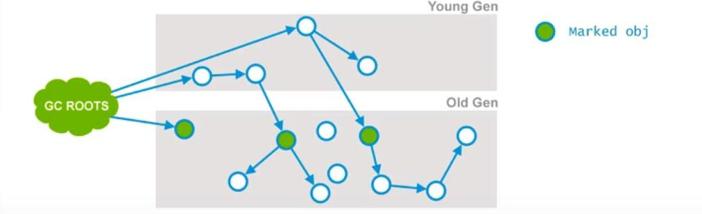

# JVM垃圾收集器

## CMS 垃圾收集器
> Concurrent Mark Sweep (并发标记清除)
### 枚举根节点
当执行系统停顿下来后，并不需要一个不漏检查所有执行上下文和全局的引用位置，虚拟机应当时有办法直接得知哪些地方存放着对象引用。在HotSpot的实现中，是使用一组称为 `OopMap`的数据结构来达到这个目的

### 安全点
在 `OopMap` 的帮助下，HotSpot可以快速且准确地完成GCRoots枚举，但一个很现实的问题随之而来：可能导致引用关系变化，或者说`OopMap`内容变化的指令非常多，如果为每一条指令都生成对应的 `OopMap`，那将会需要大量的额外空间，这样GC的空间成本将会变得非常高

实际上，HotSpot并没有为每条指令都生成 `OopMap`，而只是在 “特定的位置” 记录了这些信息，这些位置称之为安全点（`SafePoint`），即程序执行时并非在所有地方都能停顿下来开始GC，只有在达到安全点时才能暂停

`SafePoint`的选定既不能太少以至于让GC等待时间太长，也不能过于频繁以至于过分增大运行时的负载。所以，安全点的选定基本上是以“是否具有让程序长时间执行的特征”为标准进行选定的--因为每条指令的执行时间非常短暂，程序不太可能因为指令流长度太长这个原因而过长时间执行，“长时间执行”的最明显特征就是指令序列复用，例如方法调用、循环跳转、异常跳转等，所以具有这些功能的指令才会产生`SafePoint`

对于 `SafePoint`，另一个需要考虑的问题时如何在GC发生时让所有线程（这里不包括执行JNI调用的线程） 都“跑” 到最近的安全点上再停顿下来：抢占式中断（`Preemptive Suspension`）和主动式终端（`Voluntary Suspension`）
- 抢占式中断：它不需要线程的执行代码主动去配合，在GC发生时，首先把所有线程全部中断，如果有线程中断的地方不在安全点上，就恢复线程，让“它”跑到安全点上
- 主动式终端：当GC需要中断线程的时候，不直接对线程操作，仅仅简单设置一个标志，各个线程执行时主动去轮询这个标志，发现中断标志位真时就自己中断挂起。轮询标志的地方和安全点是重合的，另外在加上创建对象需要分配内存的地方
- 现在几乎没有虚拟机采用抢占式中断来暂停线程从而响应GC事件

### 安全区域
在使用 `SafePoint` 似乎已经完美解决了如何进入GC的问题，但实际情况确不一定。SafePoint机制保证了程序执行时，在不太长的时间内就会遇到可进入GC的 `SafePoint`。但是如果程序在“不执行”的时候呢？所谓程序不执行就是没有分配CPU时间，典型的例子就是出于Sleep状态或者Blocked状态，这时候线程无法响应JVM的中断请求，JVM显然也不太可能登台线程重新分配CPU时间。对于这种情况，就需要**安全区域（Safe Regin）** 来解决了

在线程执行到 `Safe Regin` 中的代码时，首先标识自己已经进入了 `Safe Regin`，那样，当这段时间里JVM要发起GC时，就不用管标识自己为 `Safe Regin` 状态的线程了。在线程要离开 `Safe Regin` 时，它要检查系统是否已经完成了根节点枚举（或者是整个GC过程），如果完成了，那线程就继续执行，否则它就必须等待直到收到可以安全离开 `Safe Regin` 的信号为止

## CMS 垃圾收集器 深入理解

### CMS 垃圾收集器  理解

CMS（Concurrent Mark Sweep）收集器，以获取最短回收停顿时间为目标，多数应用于互联网或者B/S系统的服务器端上

CMS是基于“标记-清除”算法实现的，整个过程分为4个步骤
- 初始标记 （CMS initial mark）
- 并发标记  (CMS concurrent mark)
- 重新标记  (CMS remark)
- 并发清除  (CMS concurrent sweep)

其中初始标记和重新标记这两个步骤仍然需要“Stop The World”

初始标记 只是标记一下 `GC Roots` 能直接关联到的对象，速度很快

并发标记阶段就是进行 `GC Roots Tracing` 的过程，找到所有有引用的标记

重新标记阶段则是为了修正并发标记期间因用户程序继续运作而导致标记产生变动的那一部分对象的标记记录，这个阶段的停顿时间一般会比初始标记阶段稍长一些，但远比并发标记的时间短
- 相当于对并发标记那一步的标记的修正

CMS运作步骤如下图所示，在整个过程中耗时最长的额并发标记和并发清楚过程收集器线程都可以与用户线程一起工作，因此从总体上看，CMS收集器的内存回收过程始于用户线程一起并发执行的

- 初始标记 `Stop The World`
- 并发标记，和业务线程并行
- 重新标记 `Stop The World`
- 并发清除， 和业务线程并行

### CMS 垃圾收集器  优点

并发收集，低停顿，Oracle公司的一些官方文档中也称之为并发低停顿收集器 （Concurrent Low Pause Collection）

### CMS 垃圾收集器  缺点

CMS收集器对CPU资源非常敏感

CMS收集器无法处理浮动垃圾 （Floating Garbage）,可能出现 “Concurrent Mode Failure”失败而导致另一次Full GC的产生。如果在应用中老年代增长不是太快，可以适当调高参数 `-XX:CMSInitiatingOccupancyFraction`的值来提高出发百分比，以便降低内存回收次数从而获取更好的性能。要是CMS运行期间预留的内存无法满足程序需要时，虚拟机将启动后备预案：临时启用`Serial Old`收集器来重新进行老年代的垃圾收集，这样停顿时间就很长了。所以说参数`-XX:CMSInitiatingOccupancyFraction` 设置太高很容易导致“Concurrent Mode Failure”失败，性能反而降低

收集结束会有大量空间随便产生，空间碎片过多的时候，将会给大对象分配带来很大麻烦，往往出现老年代还有很大空间剩余，但是无法找到足够大的连续空间来分配当前对象，不得不提前进行一次Full GC。CMS收集器提供了一个 `-XX:+UseCMSCompactAtFullConllection` 开关参数（默认就是开启的），用于在CMS收集器顶不住要进行FullGC时开启内存碎片的合并整理过程，内存整理的过程是无法并发的，空间碎片问题没有了，但停顿时间不得不长
- 复制算法与标记清除算法对比可以理解成用空间换时间

### 空间分配担保

在发生Minor GC之前，虚拟机会先检查老年代最大可用的连续空间是否大于新生代所有对象的总空间，如果这个条件成立，那么Minor GC可以确保是安全的。当大量对象在Minor GC后任然存活，就需要老年代进行空间分配担保，把Survivor无法容纳的对象直接进入老年代。如果老年代判断到剩余空间不足（根据以往每一次回收晋升到老年代对象容量的平均值作为经验值），则进行一次Full GC

### CMS 收集器收集步骤

- **Phase 1:** `Initial Mark`
- **Phase 2:** `Concurrent Mark`
- **Phase 3:** `Concurrent Preclean`
- **Phase 4:** `Concurrent Abortable Preclean`
    - 可能失败的
- **Phase 5:** `Final Remark`
- **Phase 6:** `Concurrent Sweep`
- **Phase 7:** `Concurrent Reset`

#### Phase 1 `Initial Mark`

这个是CMS两次 `Stop The World` 事件中的其中一次，这个阶段的目标是：标记哪些直接被`GC Root`引用或者被年轻代存活对象所引用的所有对象

- 标记 被 `GC Root` 引用
- 标记 被年轻代存活对象引用
- PS： CMS收集器是在老年代上使用的

#### Phase 2: `Concurrent Mark`

在这个阶段 Garbage Collector 会遍历老年代，然后标记所有存活的对象，它会根据上个阶段找到 `GC Roots` 遍历查找。并发标记阶段，它会与用户的应用程序并发运行。并不是老年代所有的存回对象都会被标记，因为在标记期间的用户程序可能会改变一些引用

- 在上面的图中，与阶段1的图进行对比，就会发现有一个对象的引用已经发生了变化

