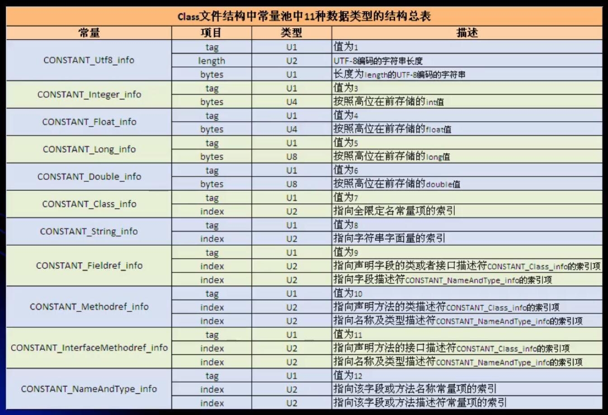

# 字节码

## `javap` 命令
**简单使用**
```
// 不需要加.class
javap MyTest1

// 查看更详细的信息
javap -c MyTest1

// 查看更详细的信息
javap -verbose MyTest1
```

**说明**
1. 使用 `javap -verbose` 命令分析一个字节码文件时，将会分析看该字节码文件的魔数、版本号、常量池、类信息、类的构造方法、类变量与成员变量等信息
    - 魔数、版本号、常量池、类信息、类的构造方法、类变量与成员变量

## 详细说明
**魔数**

所有的.class字节码文件的前4个字节都是魔数，魔数固定值: `0xCAFEBABE`

**版本号**
- 魔数之后的4个字节为版本信息
- 前两个字节表示minor version(次版本号)，后两个字节表示的是major version(主版本号)
    ```
    00 00 00 34
    minor version: 0 
    major version: 1.8
    // 所以class文件的版本为 1.8.0
    ```
    - 可以通过 `java -version` 验证

**常量池（constant pool）**
- 紧接着主版本之后的就是常量池入口
- 一个Java类中定义的很多信息都是由常量池来维护和描述的
    - 可以将常量池看作class文件的资源仓库，比如说Java类中定义的方法与变量信息
- 常量池主要存储两类常量
    - 字面量
        > 如文本字符串，Java中声明为final的常量值等
    - 符号引用
        > 如类和接口的全局限定名，字段的名称和描述符，方法的名称和描述符等。
- 常量池的总体结构：Java类所对应的常量池主要由常量池数量与常量池数组这两部分共同构成。
    - 常量池数量紧跟在主版本后面，占据2个字节
    - 常量池数组紧跟在常量池数量之后
    - 常量池数组与一般的数组不同的是
        - 常量池中不同的元素的类型、结构都是不同的，长度不同
        - 但是每一种元素的第一个数据都是一个 u1 类型
            - 该字节是个标志位，占据一个字节
            - Jvm在解析常量池时，会根据这个 u1 类型来获取元素的具体类型
    - 值得注意的是：
        - `常量池数组中元素的个数 = 常量池数 - 1 (其中0暂时不使用)`
        - 为什么要 `-1` ？ : 目的是满足某些常量池索引值的数据在特定情况下需要表达 "不引用任何一个常量池" 的含义
            - 根本原因在于，索引为0也是一个常量(保留常量)，只不过它不位于常量表中，这个常量就对应null值，索引常量值的索引从1开始
- 常量池常量的长度怎么确定
    
    - 类似与对常量在常量池中编码