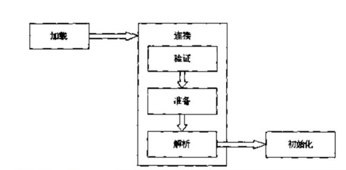
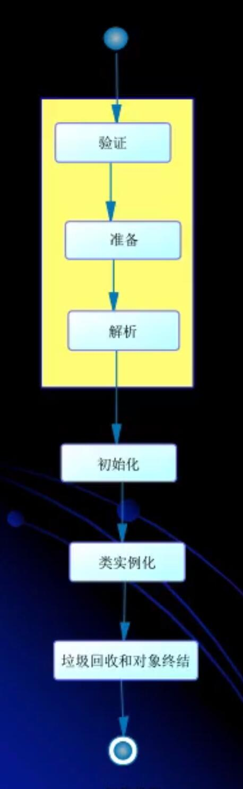

# 类加载

- 在Java代码中，**类型**的**加载**、**连接**与**初始化**过程都是在程序的**运行期间（`Runtime`）**完成的
    - 类型
    - 加载、连接、初始化
        - 加载：最常见的就是从磁盘上把编译好的字节码文件加载到内存里面
            - 并不一定严格按照顺序，比如说加载的时候对类与类的连接进行处理，这个要关注一下jvm规范
        - 连接：简单的说就是处理好类与类之间的关系
        - 初始化
            - 对类型里面的静态变量进行赋值
- 提供了更大的灵活性，增加了更多的可能性

## 类加载深入剖析
> 类加载器：用于加载类的工具

- Java虚拟机与程序的生命周期
- 以下情况下，Java虚拟机将结束生命周期
    - 执行 `System.exit()`
    - 程序正常执行结束
    - 程序在执行过程中遇到了异常或错误而异常终止
        - 自我理解：Exception
    - 由于操作系统出现错误而导致Java虚拟机进程终止
        - 自我理解：error
 
## 类加载、连接、初始化



### 加载
- 查找并加载类的二进制数据
### 连接
- 验证：确保被加载的类的正确性
- 准备：为类的**静态变量**分配内存，并将其初**始化为默认值**
    - 引用类型赋值为null
    - 示例1
        ```
        class Test{
            // 准备阶段 会赋予一个默认值0
            public static int a;
        }
        ```
    - 示例2
        ```
        class Test{
            // 在准备阶段并不是直接把a赋值为1，会赋予一个默认值0
            //  而是在后面的 【初始化】 阶段才把a赋值为1
            public static int a = 1;
        }
        ```
- 解析：把**类中的符号应用转换为直接引用**
    - 符号引用，可以理解为
    - 直接引用，指针直接指向内存地址
### 初始化
- **为类的静态变量赋予正确的初始值**

## 类的使用与卸载
- 使用
- 卸载

## Java程序对类的使用
- 注意 是 Java 程序对类的使用，而不是对 对象的使用
- 所有的Java虚拟机实现必须在每个类或接口被Java程序**首次主动使用**时才初始化它们
    - 关键点：**首次**，**主动使用**
    - 可以理解成，类已经在内存中加载和准备了，但是没有首次主动使用，并不会初始化类
### 主动使用 （应用层面） 会导致类的初始化
> 还有一个就是字节码层面

- 创建类的示例
    - `new XXX()`
- 访问某个类或接口的静态变量，或者对该静态变量赋值
    - 字节码层面：访问： `getstatic`
    - 字节码层面：赋值： `putstatic`
- 调用类的静态方法
    - 字节码层面 `invokestatic`
- 反射
    - 例如 `Class.forname(...)`
- 初始化一个子类
- Java虚拟机启动时被标明为启动类的类
- JDK1.7开始提供的动态语言支持
### 被动使用 不会导致类的初始化
- 除了对类的主动使用会导致类的初始化，其他的都不会导致对类的初始化
    - 并不意味着类不会被加载

## 类的加载
- 类的加载指的是将类的.class文件中的二进制数据读入到内存中，将其放在运行时数据区的方法区内，然后在内存中创建一个java.lang.Class对象（规范并没有说明Class对象位于哪里，HotSpot虚拟机将其放在了方法区中）用来封装类在方法区内的数据结构

- 加载.class文件的方式
    - 从本地系统中直接加载
    - 通过网络下载.class文件
    - 从zip,jar等归档文件中加载.class文件
    - 从专有数据库提取.class文件
    - **将Java源文件动态编译为.class文件**
        - 动态代理，运行期才会存在的类，编译期不存在
 
## 类的主动使用示例
**示例1**
- 分析下面这段代码 `System.out.println(MyChild1.str);` [MyTest1.java](jvm_lecture/src/main/java/org/iproute/jvm/classloader/MyTest1.java)
    ```java
    public class MyTest1 {
        public static void main(String[] args) {
            System.out.println(MyChild1.str);
        }
    }
    class MyParent1 {
        public static String str = "hello world";
        static {
            System.out.println("MyParent1 static block");
        }
    }
    class MyChild1 extends MyParent1 {
        public static String str2 = "welcome";
        static {
            System.out.println("MyChild1 static block");
        }
    }
    ```
- 输出结果
    ```text
    MyParent1 static block
    hello world
    ```
- 分析：
    - **对于静态字段来说，只有直接定义了该字段的类才会被初始化**
        - 这段代码可以理解为对 `MyParent1` 的主动使用
        - 并**没有主动使用** `MyChild1`
    - 所以 `str` 字段由 `MyParent1` 定义，只会导致 `MyParent1` 被初始化

**示例2**
- 分析下面这段代码 `System.out.println(MyChild1.str2);`  [MyTest1.java](jvm_lecture/src/main/java/org/iproute/jvm/classloader/MyTest1.java)
```java
public class MyTest1 {
    public static void main(String[] args) {
        System.out.println(MyChild1.str2);
    }
}
class MyParent1 {
    public static String str = "hello world";
    static {
        System.out.println("MyParent1 static block");
    }
}
class MyChild1 extends MyParent1 {
    public static String str2 = "welcome";
    static {
        System.out.println("MyChild1 static block");
    }
}
```
- 输出结果
```text
MyParent1 static block
MyChild1 static block
welcome
```
- 分析：
    - 是对 `MyChild1` 的主动使用
        - 但是在 **子类初始化之前必须先初始化父类**
            
**示例3 编译期间可以确定的常量**
 - 分析下面的代码 主要分析**`final`**的对输出的影响 [MyTest2.java](jvm_lecture/src/main/java/org/iproute/jvm/classloader/MyTest2.java)
```java
public class MyTest2 {
    public static void main(String[] args) {
        System.out.println(MyParent2.str);
    }
}

class MyParent2{
    public static /*final*/ String str = "hello world";
    static {
        System.out.println("MyParent2 static block");
    }
}
```
- **不加`final`**的输出结果
```text
MyParent2 static block
hello world
```
- **加了`final`**的输出结果
```text
hello world
```
- 分析
    - 在编译阶段，`str`这个常量就会存入到调用这个常量的方法所在的类的常量池中
    - 本质上，调用类并没有直接引用到定义常量的类，因此并不会触发定义常量的类的初始化
        - 这个例子中`MyTest2`去调用了这个**常量**
        - 所以在编译阶段，这个常量就会放到`MyTest2`的常量池中
        - 之后`MyTest2`和`MyParent2`就没有任何关系了
        - 甚至可以将`MyParent2`的`.class文件`**删除**都不会影响
- 尝试反编译
    - **`javap -c MyTest2.class`**

**示例4 编译期间常量不可以确定值**
- 分析下面代码 [MyTest3.java](jvm_lecture/src/main/java/org/iproute/jvm/classloader/MyTest3.java)
```java
public class MyTest3 {
    public static void main(String[] args) {
        System.out.println(MyParent3.str);
    }
}

class MyParent3 {
    public static final String str = UUID.randomUUID().toString();

    static {
        System.out.println("MyParent3 static code");
    }
}
```
- 输出结果
```text
MyParent3 static code
acb824e0-4bea-4989-a3c2-010303bfc257
```
- 分析
    - 只有运行期才会确定的常量值会导致目标类的初始化

**示例5 数组的创建并不会导致类的初始化**
-  [MyTest4.java](jvm_lecture/src/main/java/org/iproute/jvm/classloader/MyTest4.java)

## 类加载、连接、初始化 再理解


## 类加载、连接、初始化 再理解

- 加载：就是把二进制形式的Java类型读入java虚拟机中
- 连接
    - **验证**
    - **准备**：为类变量分配内存，设置默认值。但是在到达初始化之前，类变量都没有初始化为真正的初始值
    - **解析**：解析过程就是在类型的常量池中寻找类、接口、字段和方法的符号引用，把这些符号引用替换成直接引用
- 初始化：为类变量赋予正确的初始值
- 类实例化
    - 为新的对象分配内存
    - 为实例变量赋予默认值
    - 为实例变量赋予正确的初始值
    - java编译器为它编译的每一个类都知道生成一个实例初始化方法，在java的class文件中，这个实例初始化方法称为 "`<init>`"。
        - 针对源码中的每一个二类的构造方法，java编译器都会产生一个 "`<init>`" 方法
  
## 类的加载
- 类的加载的最终产品是为与内存中的Class对象
- `Class对象` 封装了类在方法区内的数据结构，并且向Java程序员提供了访问 `方法区` 的数据结构的接口
- 有两种类型的类加载器
    - Java虚拟机自带的加载器
        - 启动类加载器（BootStrap）
        - 扩展类加载器 (Extension)
        - 系统（应用）类加载器 (Application)
    - 用户自定义的类加载器
        - java.lang.ClassLoader的子类
        - 用户自己定制的加载方式
- JVM规范允许类加载器在预料到某个类将要被使用时就预先加载它，如果在预先加载的过程中遇到了.class文件缺失或存在错误，类加载器必须在程序**首次主动使用**该类的时候才报告错误（LinkageError）
    - 如果这个类一直没有被程序主动使用，那么类加载器就不会报告错误

## 类的验证
- 类文件结构检查
    - 字节码里面的内容
- 语义检查
- 字节码验证
- 二进制兼容性验证

## 类的准备
- 在准备阶段，Java虚拟机会为类的静态变量分配内存，并设置默认的初始值
- 例如下面的Sample类，在准备阶段，将为int类型的静态变量a分配4个字节内存空间，并赋予默认值0，为long类型的静态变量b分配8个字节的内存空间，并赋予默认值0
```java
class Sample{
    private static int a = 1;
    private static int b;
    static{
        b = 2;
    }
}
```
## 类的初始化
- 在初始化阶段，Java虚拟机执行类的初始化语句，为类的静态变量赋予初始值
- 在程序中，静态变量的初始化有两种途径
    - 在静态变量的声明处进行初始化
    - 在静态代码块中进行初始化

**类的初始化步骤**
- 假如这个类还没有类加载和连接，那就先进行加载和连接
- 假如类存在直接父类，并且这个父类还没有被初始化，那就先初始化父类
- 假如类中存在初始化语句，那就一次执行这些初始化语句

**类的初始化时机**
> 主动使用

- 创建类的实例
- 访问某个类或接口的静态变量，或者对该静态变量赋值
- 调用类的静态方法
- 反射
- 初始化一个类的子类
- 被标记为启动类
- 动态代理等。。。

**类的初始化时机**
- 类加载器用来把类加载到Java虚拟机中。从JDK1.2版本开始，类的加载过程采用**双亲委托机制**，这种机制能更好低保证Java平台的安全，在此委托机制中，除了Java虚拟机自带的根类加载器外，其余的类加载器有且只有一个父类加载器。

- 根类加载器
> 该加载器没有父加载器。它负责加载虚拟机的核心类库，如 `java.lang.*` 等，`java.lang.Object`就是由根类加载器加载的
> <bri> 根类加载器从系统属性 `sun.boot.class.path` 所指定的目录中加载类库。根类加载器的实现依赖于底层操作系统，属于虚拟机实现的一部分

- 扩展类加载器
> 它的父类加载器为根类加载器。它从 `java.exe.dirs` 系统属性所指定的目录中加载类库，或者从JDK的安装目录的 jre/lib/ext
字目录（扩展目录）下加载类库，如果把用户创建的jar文件放在这个目录下，也会自动由扩展类加载器加载。
> <br>扩展类加载器是纯Java类，是 `java.lang.ClassLoader` 类的子类

- 系统类加载器（也称之为 应用类加载器）
> 它的父加载器为扩展类加载器。它从环境变量 `classpath` 或者系统属性 `java.class.path ` 所指定的目录加载类，它是用户自定义的类加载器的默认父加载器。
> <br>系统类加载器是纯Java类，是 `java.lang.ClassLoader` 类的子类

- 所用用户自定义的类加载器都应继承 `java.lang.ClassLoader`

**初始化对于类和接口的异同点**
- 当初始化一个类的时候，**并不会初始化它所实现的接口**
- 当初始化一个接口的时候，**并不会先初始化它的父接口**
- 因此，一个父接口的并不会因为它的子接口的初始化而初始化。只有当程序首次使用特定接口的静态变量时，才会导致接口的初始化
    - 分析下面的例子
        ```java
        public class Test{
          public static void main(String[] args){
            System.out.println(Child.b);
          }
        }
        interface Parent{
          int a = 5;
        }
        class Child extends Parent{
          public static int b = 5;
        }
        ```
    - 结果
        - 这个接口会被加载，因为b不是一个常量，所以满足了对类的主动调用
            - 是加载不是初始化
        - 类的加载会导致父类也被加载
            - 是加载不是初始化
        - 如果加了final就不会导致初始化
> 试验的时候可以在编译完成的时候，将父接口的.class对象删除然后再次运行，这个是和加载有关系的


