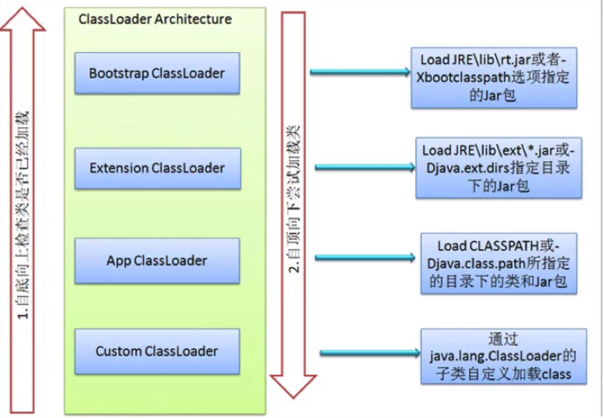

# 类加载器
- 在双亲委托机制中，各个加载器按照父子关系形成**树形结构**，除了根类加载器之外，其余的类加载器都**有且只有一个父类加载器**

## 获取ClassLoader 的方法

- 获取当前类的ClassLoader
    - `clazz.getClassLoader`
- 获取当前线程上下文的ClassLoader
    - `Thread.currentThread().getContextClassLoader()`
- 获取系统的ClassLoader
    - `ClassLoader.getSystemClassLoader()`
- 获得调用者的ClassLoader
    - `DriverManager.getCallerClassLoader()`
    
## 类加载器的JavaDoc分析
```text
类加载器是负责加载类的对象。

ClassLoader类是一个抽象类。

给定类的二进制名称，类加载器应尝试查找或生成构成该类定义的数据。

一种典型的策略是将名称转换为文件名，然后从文件系统中读取该名称的“类文件”。

每个Class对象都包含对定义它的ClassLoader的引用。

数组类的类对象不是由类加载器创建的，而是根据Java运行时的要求自动创建的。由Class.getClassLoader（）返回的数组类的类加载器与其元素类型的类加载器相同。

如果元素类型是原始类型，则数组类没有类加载器。

应用程序实现ClassLoader的子类，以扩展Java虚拟机动态加载类的方式。

安全管理人员通常可以使用类加载器来指示安全域。 ClassLoader类使用委托模型搜索类和资源。

每个ClassLoader实例都有一个关联的父类加载器。
当请求查找类或资源时，ClassLoader实例会将对类或资源的搜索委托给其父类加载器，然后再尝试查找类或资源本身。

虚拟机的内置类加载器（称为“引导类加载器”）本身没有父级，但可以用作ClassLoader实例的父级。
支持并发加载类的类加载器称为具有并行功能的类加载器，并且要求它们通过调用ClassLoader.registerAsParallelCapable方法在其类初始化时进行自身注册。

请注意，默认情况下，ClassLoader类注册为具有并行功能。
但是，如果它们的子类具有并行功能，则仍然需要注册自己。

在委派模型不是严格分层的环境中，类加载器需要具有并行功能，否则类加载会导致死锁，因为在类加载过程中保持了加载器锁（请参见loadClass方法）。

通常，Java虚拟机以平台相关的方式从本地文件系统加载类。

例如，在UNIX系统上，虚拟机从CLASSPATH环境变量定义的目录中加载类。

但是，某些类可能不是源自文件的。它们可能源自其他来源，例如网络，也可能由应用程序构造。

方法defineClass将字节数组转换为Class类的实例。

可以使用Class.newInstance创建此新定义的类的实例。
由类加载器创建的对象的方法和构造函数可以引用其他类。
为了确定所引用的类，Java虚拟机将调用最初创建该类的类加载器的loadClass方法。

```

## 自定义类加载器
[MyTest16.java](jvm_lecture/src/main/java/com/winterfell/jvm/classloader/MyTest16.java)

**注意点**
- 把ide自动编译出来的class对象删除
    - 自定义类加载器在加载的时候会委托给父类加载器（系统类加载器）去加载
    - 系统类加载器会加载classpath下的东西,MyTest1.class会被加载，tmp目录里面的MyTest1.class不会被加载
    
**类加载器的命名空间**
- 每个类加载器都有自己的命名空间，**命名空间由该加载器及所有父加载器所加载的类组成**
- 在同一个命名空间中，不会出现类的完整名字（包括类的包名）相同的两个类
- 在不同的命名空间，有可能会出现类的完整名字（包括类名和包名）相同的两个类

**不同类加载器命名空间的关系**
- 同一个命名空间的类是相互可见的
- 子加载器的命名空间包含所有父加载器的命名空间。
    - 因此由子加载器加载的类能看见父加载器加载的类
    - 例如系统类加载器加载的类能看见根类加载器加载的类
- 由父加载器加载的类不能看见子加载器加载的类
    - 如果两个加载器之间没有直接或者间接的父子关系，那么它们各自加载的类相互**不可见**

**类加载器的命名空间的重要说明**
- 子加载器加载的类可以访问父加载器加载的类
- 父加载器加载的类不能访问子加载器加载的类

## 类的卸载

- 由Java虚拟机自带的类加载器所加载的类，在虚拟机的生命周期中，始终不会被卸载。
- Java虚拟机自带的类加载器包括根类加载器、扩展类加载器、系统类加载器
- Java虚拟机本身会使用引用这些类加载器，而这些类加载器则会始终引用它们所加载的类的Class对象，因此这些Class对象始终是可以触及的

## 双亲委派机制


**优点**
1. 可以确保Java核心库的类型安全：所有的Java应用都至少会引用 java.lang.Object类，也就是说在运行期间，java.lang.Object这个类会被加载到 Java虚拟机中
    - 如果这个加载过程是有Java应用自己的类加载器所完成的，那么很可能就会在JVM中存在多个版本的 java.lang.Object 类，而且这些类之间还是不兼容的，相互不可见的
        - 不可见是命名空间发挥的作用
    - 借助于双亲委托机制，Java核心类库中的类的加载工作都是有启动类加载器来统一完成，从而确保了Java应用所使用的都是同意版本的Java核心类库，它们之间是互相兼容的
2. 可以确保Java核心类库所提供的类不会被自定义的类所替代
3. 不同的类加载器可以为相同名称(binary name)的类创建额外的命名空间。相同名称的类可以并存在Java虚拟机中，只需要用不同的类加载器加载它们即可
    - 不同类加载器锁加载的类之间是不兼容的
    - 这就相当于在Java虚拟机内部创建了一个有一个相互隔离的Java类空间，这类技术在很多框架中都得到了实际应用

## 类路径启动参数
- `-Dsun.boot.class.path=...`
- `-Djava.ext.dirs=...`
- `-Djava.class.path=...`

## 简单源码分析
- `ClassLoader`
```text
类加载器是负责加载类的对象。 ClassLoader类是一个抽象类。给定类的二进制名称，类加载器应尝试查找或生成构成该类定义的数据。一种典型的策略是将名称转换为文件名，然后从文件系统中读取该名称的“类文件”。
每个Class对象都包含对定义它的ClassLoader的引用。
数组类的类对象不是由类加载器创建的，而是根据Java运行时的要求自动创建的。由Class.getClassLoader（）返回的数组类的类加载器与其元素类型的类加载器相同。如果元素类型是原始类型，则数组类没有类加载器。
应用程序实现ClassLoader的子类，以扩展Java虚拟机动态加载类的方式。
安全管理人员通常可以使用类加载器来指示安全域。
ClassLoader类使用委托模型搜索类和资源。每个ClassLoader实例都有一个关联的父类加载器。当请求查找类或资源时，ClassLoader实例会将对类或资源的搜索委托给其父类加载器，然后再尝试查找类或资源本身。虚拟机的内置类加载器（称为“引导类加载器”）本身没有父级，但可以用作ClassLoader实例的父级。
支持并发加载类的类加载器称为具有并行功能的类加载器，并且要求它们通过调用ClassLoader.registerAsParallelCapable方法在其类初始化时进行自身注册。请注意，默认情况下，ClassLoader类注册为具有并行功能。但是，如果它们的子类具有并行功能，则仍然需要注册自己。在委派模型不是严格分层的环境中，类加载器需要具有并行功能，否则类加载会导致死锁，因为在类加载过程中保持了加载器锁（请参见loadClass方法）。
通常，Java虚拟机以平台相关的方式从本地文件系统加载类。例如，在UNIX系统上，虚拟机从CLASSPATH环境变量定义的目录中加载类。
但是，某些类可能不是源自文件的。它们可能源自其他来源，例如网络，也可能由应用程序构造。方法defineClass将字节数组转换为Class类的实例。可以使用Class.newInstance创建此新定义的类的实例。
由类加载器创建的对象的方法和构造函数可以引用其他类。为了确定所引用的类，Java虚拟机将调用最初创建该类的类加载器的loadClass方法。
例如，应用程序可以创建网络类加载器以从服务器下载类文件。示例代码可能如下所示：
     ClassLoader loader = new NetworkClassLoader(host, port);
     Object main = loader.loadClass("Main", true).newInstance();
          . . .
网络类加载器子类必须定义方法findClass和loadClassData才能从网络加载类。下载构成类的字节后，应使用defineClass方法创建一个类实例。一个示例实现是：
       class NetworkClassLoader extends ClassLoader {
           String host;
           int port;
  
           public Class findClass(String name) {
               byte[] b = loadClassData(name);
               return defineClass(name, b, 0, b.length);
           }
  
           private byte[] loadClassData(String name) {
               // load the class data from the connection
                . . .
           }
       }
二进制名称
作为ClassLoader中方法的String参数提供的任何类名称，都必须是Java™语言规范所定义的二进制名称。
有效类名的示例包括：
     “ java.lang.String”
     “ javax.swing.JSpinner $ DefaultEditor”
     “ java.security.KeyStore $ Builder $ FileBuilder $ 1”
     “ java.net.URLClassLoader $ 3 $ 1”
```

- `ClassLoader.getSystemClassLoader()`
```text
返回用于委托的系统类加载器。这是新ClassLoader实例的默认委派父级，通常是用于启动应用程序的类加载器。
首先在运行时的启动顺序中首先调用此方法，此后它将创建系统类加载器并将其设置为调用线程的上下文类加载器。
默认的系统类加载器是此类的与实现相关的实例。
如果在首次调用此方法时定义了系统属性“ java.system.class.loader”，则该属性的值将作为要作为系统类加载器返回的类的名称。该类使用默认的系统类加载器加载，并且必须定义一个公共构造函数，该构造函数采用ClassLoader类型的单个参数作为委托父级。然后使用此构造函数创建一个实例，并使用默认系统类加载器作为参数。结果类加载器定义为系统类加载器。
如果存在安全管理器，并且调用者的类加载器不为null且调用者的类加载器与系统类加载器不同或祖先，则此方法使用RuntimePermission（“ getClassLoader”来调用安全管理器的checkPermission方法。 ）的权限，以验证对系统类加载器的访问权限。否则，将引发SecurityException。
```

## 线程上下文类加载器 
- `Current ClassLoader` 每个类都会使用自己的类加载器（即加载自身的类加载器）来去加载其他类（指的是所依赖的类）
    - 如果ClassX 引用了 ClassX 那么ClassX的类加载器就会尝试着去加载ClassY
        - 前提是ClassY尚未被加载
            - 尚未被加载在同一命名空间
- 线程上下文类加载器是从JDK1.2引入的，类`Thread`中的`getContextClassLoader()`与`setContextClassLoader(ClassLoader cl)` 分别用来获取和设置上下文类加载器
    - 如果没有通过`setContextClassLoader(ClassLoader cl)`进行设置的话，线程将继承其父线程的上下文类加载器
- Java应用运行时的**初始线程的上下文加载器是系统类加载器（main）**。在线程中运行的代码可以通过该类加载器来加载类与资源
- 线程上下文类加载器的重要性：
